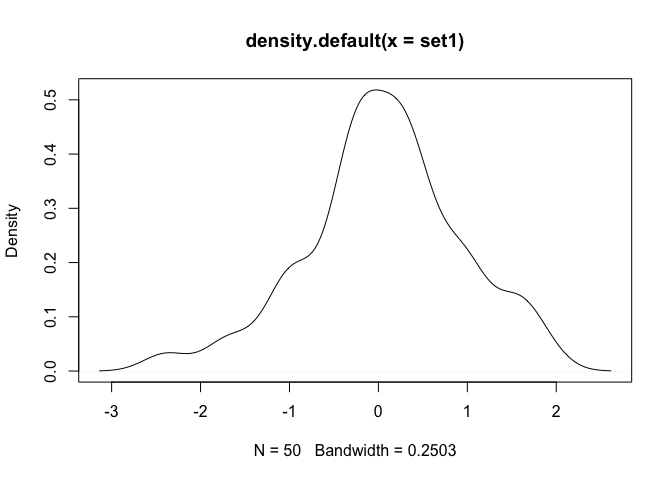
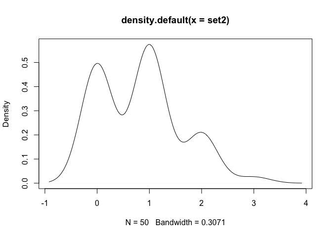

<!-- README.md is generated from README.Rmd. Please edit that file -->

# checknormality

<!-- badges: start -->

[](https://travis-ci.com/chrsshn/checknormality)
[](https://codecov.io/gh/chrsshn/checknormality?branch=main)
<!-- badges: end -->

The goal of checknormality is to provide an implementation of popular
normality tests that returns the test statistics as well as plots the
distributions of sample points. Comparable versions of the Shapiro-Wilk
test and the Kolmogorov-Smirnov test are accessible through the base
stats package (base::shapiro.test and base::ks.test, respectively).

## A Note on the Algorithms

### Shapiro-Wilk Test

  - For 2 \<= n \<= 50, there are two “options”: the original approach
    for the Shapiro-Wilk test as described
    [here](https://www.real-statistics.com/tests-normality-and-symmetry/statistical-tests-normality-symmetry/shapiro-wilk-test/)
    and a modified approach that is compatible with the Royston approach
    (see below) as described in the last paragraph
    [here](https://www.real-statistics.com/tests-normality-and-symmetry/statistical-tests-normality-symmetry/shapiro-wilk-test/).

  - For n \> 50, the J. P. Royston approach for the Shapiro-Wilk test as
    described
    [here](https://www.real-statistics.com/tests-normality-and-symmetry/statistical-tests-normality-symmetry/shapiro-wilk-expanded-test/)
    is used.

## Installation

You can install the released version of checknormality from
[CRAN](https://CRAN.R-project.org) with:

``` r
install.packages("checknormality")
```

And the development version from [GitHub](https://github.com/) with:

``` r
# install.packages("devtools")
devtools::install_github("chrsshn/checknormality")
```

## Example 1: Testing a sample from a normal distribution

``` r
library (checknormality)
set1 <- rnorm (50, 0, 1)
shapiro.test (set1)
#> 
#>  Shapiro-Wilk normality test
#> 
#> data:  set1
#> W = 0.98753, p-value = 0.8723
sw_test (set1)
#> 
#>  Shapiro-Wilk Test of Normality
#> 
#> data:  set1
#> W = 0.98601, p-value = 0.9168
plot(density (set1))
```



## Example 2: Testing a sample from a normal distribution

``` r
library (checknormality)
set2 <- rpois(50, .787)
shapiro.test (set2)
#> 
#>  Shapiro-Wilk normality test
#> 
#> data:  set2
#> W = 0.78751, p-value = 4.573e-07
sw_test (set2)
#> 
#>  Shapiro-Wilk Test of Normality
#> 
#> data:  set2
#> W = 0.78452, p-value = 0.93
plot(density (set2))
```


