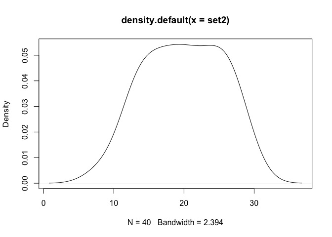

<!-- README.md is generated from README.Rmd. Please edit that file -->

# checknormality

<!-- badges: start -->

[](https://travis-ci.com/chrsshn/checknormality)
[](https://codecov.io/gh/chrsshn/checknormality?branch=main)
<!-- badges: end -->

The goal of checknormality is to provide an implementation of popular
normality tests that returns the test statistics from various normality
tests. Comparable versions of the Shapiro-Wilk test and the
Kolmogorov-Smirnov test are accessible through the base stats package
(base::shapiro.test and base::ks.test, respectively). As of 2020/11/28,
only the

## A Note on the Algorithms

### Shapiro-Wilk Test

  - For n \> 50, the J. P. Royston approach for the Shapiro-Wilk test as
    described
    [here](https://www.real-statistics.com/tests-normality-and-symmetry/statistical-tests-normality-symmetry/shapiro-wilk-expanded-test/)
    must be used

  - For 3 \<= n \<= 50, there are three “options”: the original approach
    for the Shapiro-Wilk test as described
    [here](https://www.real-statistics.com/tests-normality-and-symmetry/statistical-tests-normality-symmetry/shapiro-wilk-test/),
    a modified approach that is compatible with the Royston approach as
    described in the last paragraph
    [here](https://www.real-statistics.com/tests-normality-and-symmetry/statistical-tests-normality-symmetry/shapiro-wilk-test/),
    and the Royston approach for n \> 20

### Inverse of Normal CDF (Phi inverse)

  - The Royston approach requires the inverse of the normal CDF, which
    is called in R with stats::qnorm(p)
  - In the Rcpp implementation of the Royston approach, a
    [freely-available stand-alone C++
    implementation](https://www.johndcook.com/blog/cpp_phi_inverse/) was
    used

## Installation

You can install the released version of checknormality from
[CRAN](https://CRAN.R-project.org) with:

``` r
install.packages("checknormality")
```

And the development version from [GitHub](https://github.com/) with:

``` r
# install.packages("devtools")
devtools::install_github("chrsshn/checknormality")
```

## Example 1: Testing a sample from a normal distribution using the Royston and modified approaches

``` r
library (checknormality)
set1 <- rnorm (30, 0, 1)
shapiro.test (set1)
#> 
#>  Shapiro-Wilk normality test
#> 
#> data:  set1
#> W = 0.97869, p-value = 0.7898
sw_test (set1, "royston")
#> 
#>  Shapiro-Wilk Test of Normality
#> 
#> data:  set1
#> W = 0.97846, p-value = 0.7833
sw_test (set1, "modified")
#> 
#>  Shapiro-Wilk Test of Normality
#> 
#> data:  set1
#> W = 0.97696, p-value = 0.7507
plot(density (set1))
```


## Example 2: Testing a sample from a non-normal distribution using the Royston and modified approaches

``` r
library (checknormality)
set2 <- rpois(40, .787)
shapiro.test (set2)
#> 
#>  Shapiro-Wilk normality test
#> 
#> data:  set2
#> W = 0.81949, p-value = 1.772e-05
sw_test (set2, "royston")
#> 
#>  Shapiro-Wilk Test of Normality
#> 
#> data:  set2
#> W = 0.8204, p-value = 2e-05
sw_test (set2, "modified")
#> 
#>  Shapiro-Wilk Test of Normality
#> 
#> data:  set2
#> W = 0.81529, p-value = 0.001
plot(density (set2))
```


