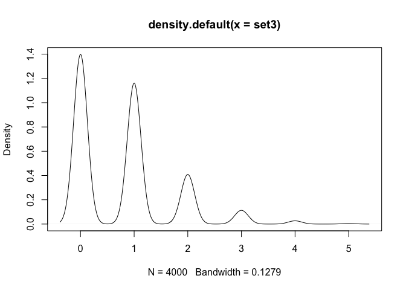
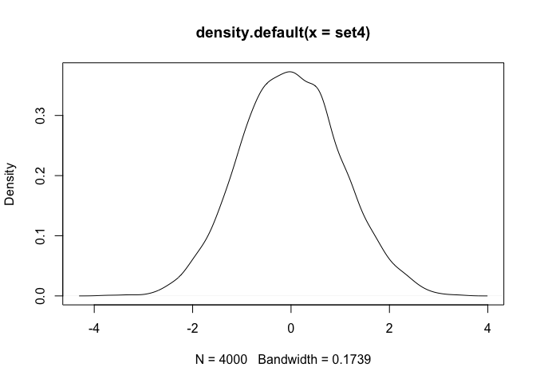

<!-- README.md is generated from README.Rmd. Please edit that file -->

# checknormality: because you should always check your assumptions

<!-- badges: start -->

[](https://travis-ci.com/chrsshn/checknormality)
[](https://codecov.io/gh/chrsshn/checknormality?branch=main)
<!-- badges: end -->

## Overview

The goal of checknormality is to provide implementations of popular
normality tests that return the test statistics and p-values. As of
2020/11/30, the package contains an implementation of the [Shapiro-Wilk
Test of
Normality](https://en.wikipedia.org/wiki/Shapiro%E2%80%93Wilk_test).

## A Note on the Algorithms

### Shapiro-Wilk Test

  - For n \> 50, the J. P. Royston approach for the Shapiro-Wilk test as
    described
    [here](https://www.real-statistics.com/tests-normality-and-symmetry/statistical-tests-normality-symmetry/shapiro-wilk-expanded-test/)
    must be used.

  - For 3 \<= n \<= 50, there are three “approaches”: the original
    approach for the Shapiro-Wilk test as described
    [here](https://www.real-statistics.com/tests-normality-and-symmetry/statistical-tests-normality-symmetry/shapiro-wilk-test/),
    a modified approach that is compatible with the Royston approach as
    described in the last paragraph
    [here](https://www.real-statistics.com/tests-normality-and-symmetry/statistical-tests-normality-symmetry/shapiro-wilk-test/),
    and the Royston approach for n \> 20.

### Inverse of Normal CDF (Phi inverse)

  - The Royston approach requires the inverse of the normal CDF, which
    is calculated in R using

<!-- end list -->

``` r
stats::qnorm(p)
```

  - In the Rcpp implementation of the Royston approach, a
    [freely-available stand-alone C++
    implementation](https://www.johndcook.com/blog/cpp_phi_inverse/) was
    used.

## Installation

You can install the development version from
[GitHub](https://github.com/) with:

``` r
# install.packages("devtools")
devtools::install_github("chrsshn/checknormality")
```

## Usage

### Example 1: Testing a small sample from an exponential distribution using the original, modified, and Royston approaches

``` r
set1 <- rexp (30, .8)
checknormality::sw_test (set1, "original")
#> 
#>  Shapiro-Wilk Test of Normality
#> 
#> data:  set1
#> W = 0.82225, p-value = 0.001
checknormality::sw_test (set1, "modified")
#> 
#>  Shapiro-Wilk Test of Normality
#> 
#> data:  set1
#> W = 0.82225, p-value = 0.001
checknormality::sw_test (set1, "royston")
#> 
#>  Shapiro-Wilk Test of Normality
#> 
#> data:  set1
#> W = 0.82178, p-value = 0.00017
stats::shapiro.test (set1) 
#> 
#>  Shapiro-Wilk normality test
#> 
#> data:  set1
#> W = 0.82183, p-value = 0.0001683
plot(density (set1))
```


### Example 2: Testing a small sample from a normal distribution using the original, modified, and Royston approaches

``` r
set2 <- rnorm (40, 20, 5)
checknormality::sw_test (set2, "original")
#> 
#>  Shapiro-Wilk Test of Normality
#> 
#> data:  set2
#> W = 0.97705, p-value = 0.6567
checknormality::sw_test (set2, "modified")
#> 
#>  Shapiro-Wilk Test of Normality
#> 
#> data:  set2
#> W = 0.97705, p-value = 0.6567
checknormality::sw_test (set2, "royston")
#> 
#>  Shapiro-Wilk Test of Normality
#> 
#> data:  set2
#> W = 0.98479, p-value = 0.858
stats::shapiro.test (set2)
#> 
#>  Shapiro-Wilk normality test
#> 
#> data:  set2
#> W = 0.98132, p-value = 0.7384
plot(density (set2))   
```


### Example 3: Testing a large sample from a Poisson distribution using the Royston approach

note: the original and modified approaches are only valid for n \< 50
points

``` r
set3 <- rpois(4000, .787)
checknormality::sw_test (set3, "royston")
#> 
#>  Shapiro-Wilk Test of Normality
#> 
#> data:  set3
#> W = 0.79403, p-value < 2.2e-16
stats::shapiro.test (set3)
#> 
#>  Shapiro-Wilk normality test
#> 
#> data:  set3
#> W = 0.79409, p-value < 2.2e-16
plot(density (set3))   
```



## Example 4: Testing a large sample from a normal distribution using the Royston approach

note: the original and modified approaches are only valid for n \< 50
points

``` r
set4 <- rnorm(4000)
checknormality::sw_test (set4, "royston")
#> 
#>  Shapiro-Wilk Test of Normality
#> 
#> data:  set4
#> W = 0.99963, p-value = 0.7055
stats::shapiro.test (set4)
#> 
#>  Shapiro-Wilk normality test
#> 
#> data:  set4
#> W = 0.9997, p-value = 0.8593
plot(density (set4))   
```


